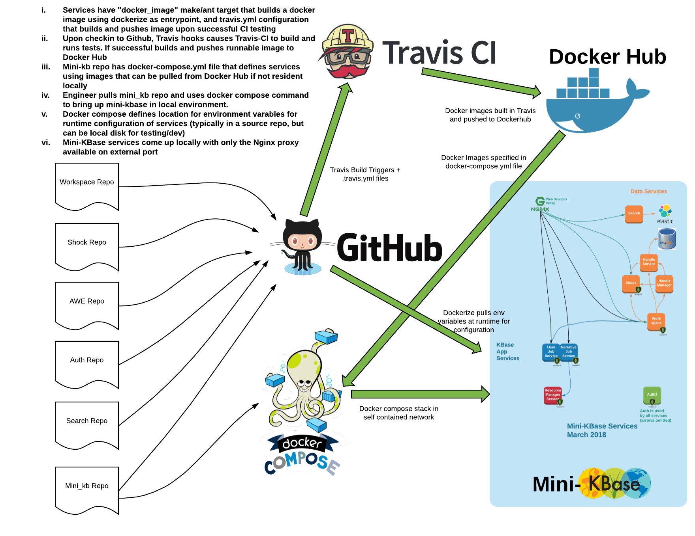
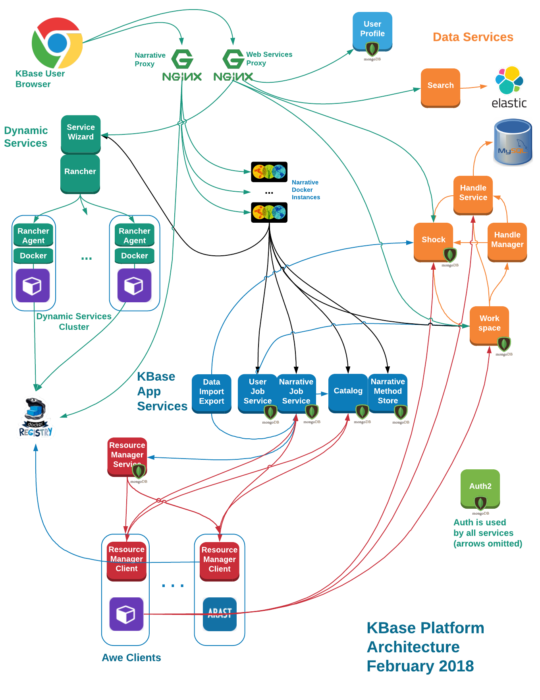
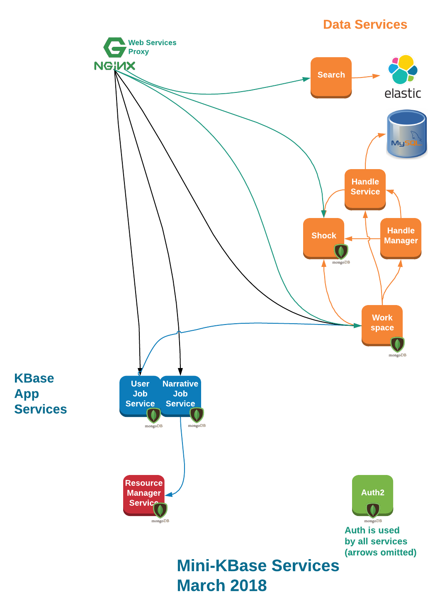

# mini_kb
Docker-compose configuration that brings up a mini-KBase

Includes configurations for all of the services to setup a minimal test environment

TL;DR
======

1. Install docker-compose and its dependencies
1. Clone the mini-kb repo
1. cd into the repo
1. run "start_minikb.sh"
1. The mini-kb front proxy is now listening on port 8000. KBase services can be found under http://localhost:8000/services/{servicename}

Relationships between Mini-KBase and Release Process
=================================

The following diagram shows the relationship of Mini-KBase to the overall release engineering process flow.

Mini-KBase vs Full KBase
========================

Mini-KBase is a work in progress, as of March 8, 2018, the images below show the mini-kbase services and the full KBase services for comparison. The full set of services available can always be found in the docker-compose.yml file.

Structure of KBase Environment Docker Images
==========================

Docker images used for mini-kbase use a [modified version](https://github.com/kbase/dockerize) of [dockerize](https://github.com/jwilder/dockerize)

Documentation for dockerize can be found at the github links above. In addition to the original
dockerize features, the KBase fork has been extended to inject the contents of INI files into the
environment as well options to pass headers along when fetching the INI file over http and an
option to turn off certificate validation on SSL connections.

Mini-kbase images generally use dockerize as the entrypoint, and templated configuration files are
then rendered using whatever environment variables that are passed in. The dockerize tool can also
be configured to wait for upstream dependency endpoints to start accepting TCP connections before
starting the primary container program.

The layout of each docker image follows current KBase conventions with the primary configuration
file identified by the KB_DEPLOYMENT_CONFIG environment variable, and the majority of the image
specific files under /kb/deployment, with /kb/deployment/services/{servicename} generally being
the location for the executable and support files for the image's primary program.

Here is a typical snippet from a dockerfile that shows how dockerize is typically called:

~~~
ENV KB_DEPLOYMENT_CONFIG=/kb/deployment/conf/deployment.cfg

ENTRYPOINT [ "/kb/deployment/bin/dockerize" ]

# Here are some default params passed to dockerize. They would typically
# be overidden by docker-compose at startup
CMD [  "-template", "/kb/deployment/conf/.templates/deployment.cfg.templ:/kb/deployment/conf/deployment.cfg", \
       "java", "-DSTOP.PORT=8079", "-DSTOP.KEY=foo", "-Djetty.home=$JETTY_HOME", \
       "-jar", "$JETTY_HOME/start.jar" ]
~~~

The entrypoint is the dockerize binary itself, with the parameters set in the CMD section so that it can be
reconfigured conveniently at runtime. The "-template" "/kb/deployment/conf/.templates/deployment.cfg.templ:/kb/deployment/conf/deployment.cfg" arguments tells dockerize to
look in the file /kb/deployment/conf/.templates/deployment.cfg.templ for a dockerize template, render it with the
current set of environment variables and then write it out to /kb/deployment/conf/deployment.cfg, which was setup
to be the configuration file by the KB_DEPLOYMENT_CONFIG environment variable.

Multiple template files can be renders by additional "-template src:dest" directives when a program has configuration
spread across multiple locations

The next set of options to dockerize spins up the jvm and hands off executing to the the JETTY server, after
which the jetty configuration that has been laid out on the image will take over. Dockerize will than wait for
the jvm to finish executing before exiting. Please see the dockerize documentation for additional directives
that can be used to tail files to the console, wait for upstream services to come up before starting the main
program, etc...

Mini-KBase and Docker-Compose
=============================

Mini-kbase consists of multiple images with dependencies among them - this is handled using [docker-compose](https://docs.docker.com/compose/). The docker-compose.yml file refers to containers found in
[dockerhub](https://hub.docker.com/u/kbase/). In turn, all of these dockerhub containers are built from repos found in [github](https://github.com/kbase). All of the
images necessary for core KBase functionality have publicly accessible github repos. Some images that are
operational (such as logging) are in private repos. Genuinely sensitive information such as details of
credentials used for runtime services are passed into docker-compose via the env_file directive
or as an env-file directive to the entrypoint of a docker container, which are then used to evaluate
templated configuration files. In the core KBase infrastructure, the docker-compose file would have a
different set of env-file directives than mini-kbase, but would otherwise use exactly the same images.

Mini-kbase mirrors what is used in the KBase CI, AppDev, Next and Prod environments, and can also be
used in [Rancher](https://rancher.com/rancher/) based deployments. Docker-compose and docker are requirements
for mini-kbase and need to be installed locally before trying to bring up mini-kbase.

The [docker-compose.yml](https://docs.docker.com/compose/compose-file/) file in this repo defines the mini-kbase
environment which the docker-compose command brings up. It brings up an nginx proxy front end which is exposed
to the external network via port 8000, shared mongo-db and mysql backends which are restricted to the private
docker network, and a collection of KBase services (including kbase-ui) which can see each other based on their
service names, but can only be accessed outside of the docker environment via the nginx proxy.

The nginx proxy is configured so that queries to http://nginx/services/servicename are proxied to the
container named "servicename" on port 8080. For example, the container called "workspace" brings up
it's listener on port 8080, and is accessible via http://workspace:8080/ within the private docker network,
but it is not directly exposed outside of the docker network. However a request that comes into the nginx
proxy requesting /services/workspace in the path component will be proxied to workspace port 8080. This is
configured as a regular expression in the nginx configuration, and names are dynamically resolved by the
docker DNS services so new containers on the docker network do not need to be added to the nginx configuration.
This means that so long as an entry is added to docker-compose.yml with a listener on port 8080, it will be
available via the nginx proxy.

This also means that if a docker container is brought up manually and its
network is manually set to minikb_default ( the name of the mini-kbase private network ) with the docker run
option *--network="minikb_default"*, it will also be accessible by the nginx proxy (as well as the other
containers within mini-kbase) by the name assigned to the container. An example of this will be shown later in
this document.

Please refer to the (docker-compose documentation)[https://docs.docker.com/compose/compose-file/] for details
on syntax and structure of the included docker-compose.yml file. This README file assumes the reader is familiar
with the main ocker-compose documentation and only discusses relevant customizations.

Mini-KBase tasks
================

Bring up mini-kbase
-------------------
Mini-kbase stack is a straightforward docker-compose stack and can be brought up using the standard "docker-compose pull" and "docker-compose up" commands. There are some things to be aware of:
1. Docker-compose is able to start services in dependency order, however it is unable to wait until a service is actually fully initialized before starting the services downstream. To deal with this, containers all use the [dockerize](https://github.com/kbase/dockerize) program as an entrypoint. This is a small Golang based binary that can be passed  a *-wait* option to poll a dependency's listener port until it accepts tcp connections before starting the main executable. Because dependencies can run deep and startup latencies begin to stackup, the dockerize command is typically given a fairly long *-timeout* flag as well.
1. By default, all of the services in mini-kbase operate in a private docker network called "minikb_default". The services that listen on this network cannot be accessed outside of this private network. The nginx proxy serves as a gateway between external networks and the private docker network, and access to the private work is intended to pass through the nginx proxy.
1. Some of the services, such as workspace, require their databases to be initialized before start up. This is accomplished by the [db-init container](https://github.com/kbase/db_initialize). It waits for mongodb and mysql to come up and then bootstraps the data necessary for other services. After the data is fully loaded, it brings up a dummy listener on port 8080 that accepts connections but does nothing with them. This allows other services that depend on database initialization to wait until there is a listener on db-init:8080 before starting up. In the configuration for workspace, there is a "-wait tcp://db-init:8080" directive that tells the entrypoint program to delay starting the main workspace service until db-init has finished running.
1. The full mini-kbase stack requires significant memory and not all machines may be capable of running all of mini-kbase. On a circa 2016 Macbook Pro with 16G of memory, it is not possible to run all services available in mini-kbase. The "nginx" service in mini-kbase specifies in its depends_on directive a core set of services that many other mini-kbase services require. It should be possible to bring up the nginx proxy and its core dependencies using "*docker-compose up nginx*" on a reasonably powerful host. Other services can be brought up as needed using "*docker-compose up {servicename}*". Running "docker-compose up" to bring up all services may result in memory limitations causing startup failures.

The start_minikb.sh shell script brings up the basic nginx proxy and core services. The nginx proxy is used to access all public services within mini-kbase and listens on port 8000. It is recommended to use start_minikb.sh to bring up a core set of services, and if there are additional services not brought up by default, they should be brought up explicitly using "docker-compose up {service_name}"

Modifying the configuration of a service
----------------------------------------
As a rule, the containers used in mini-kbase are intended to be exactly the same containers used in KBase CI, AppDev
and production. Because of this, all environment specific configurations are intended to be passed in
via environment variables that modify templated configuration files. The dockerize entrypoint handles filling in
the templates and writing out the configuration files. Docker images in mini-kbase generally have the
KB_DEPLOYMENT_CONFIG environment variable set in a Dockerfile. This environment variable is the convention used as the
path to an INI file used to configure KBase services. Typically this is set to /kb/deployment/conf/deploy.cfg and the
dockerize command is configured to write a configuration file to this path. Here is an example of a docker-compose
stanza that shows how dockerize is called.

~~~
  nginx:
    image: kbase/nginx:latest
    command:
      - "-template"
      - "/kb/deployment/conf/.templates/nginx.conf.templ:/etc/nginx/nginx.conf"
    #  - "-env"
    #  - "https://raw.githubusercontent.com/kbase/mini_kb/master/deployment/conf/nginx-minikb.ini"
      - "nginx"
    env_file:
      - deployment/conf/nginx-minikb.ini
    # To bypass the nginx.conf.templ file and use a fully customized nginx.conf file, comment out the 2
    # -template option above that expends the nginx.conf.templ file, and uncomment the following 2 lines
    # and replace /tmp/nginx.conf with the path to the appropriate file.
    # volumes:
    #  - /tmp/nginx.conf:/etc/nginx/nginx,conf
    ports:
      - "8000:80"
    depends_on: ["auth", "handle_service", "handle_manager", "workspace", "shock", "ujs"]
~~~

This stanza is used to configure nginx. The nginx image should have "dockerize" as the entrypoint, so the command options here are used to configure how nginx runs.
* The first 2 command lines result in the following parameters passed to dockerize
  *-template /kb/deployment/conf/.templates/nginx.conf.templ:/etc/nginx/nginx.conf* 
  This results in the file /kb/deployment/conf/.templates/nginx.conf.templ in the docker image being treated as a golang template that dockerize evaluates using the available environment variables and then writes the output to /etc/nginx/nginx.conf

  The nginx container doesn't have KBase specific service, so we don't have a template directive that writes anything to
  /kb/deployment/conf/deploy.cfg, but most of the other services will have a -template directive for this target.
* The next 2 lines are commented out, but would tell dockerize to read the url https://raw.githubusercontent.com/kbase/mini_kb/master/deployment/conf/nginx-minikb.ini as a file containing name/value pairs that are converted into environment variables for the running program, as well as used for template evaluate. This line is commmented out however it is functionally identical to the "env_file" specification lower in the file, however it doesn't require changes to the repo to be pushed to github before becoming available. This is helpful for local testing, where the changes don't need to be recorded in the repo
* The 5th line simply tells dockerize to run nginx as the final task. Because we have generated an nginx.conf file in the default location, nginx should come up and serve the files we want. The dockerize command will continue to run until nginx exits. When nginx exits, dockerize will exit as well and the container will stop running.
* The next 2 lines tell docker to use the file deployment/conf/nginx-minikb.ini in the current repo as a set of name=value pairs to set environment variables available in the running container. Using the env_file directive is very useful for testing and debugging configurations that are not ready or needed to be permanently committed to git (where the -env directive is passed to dockerize for use). Note that using env_file to docker-compose makes these environment variables available to any process running in the container, while the -env directive to dockerize only makes these environment variables available to the program that dockerize is configured to start. For example, if you exec a shell into the running container, the "env" command will show variables set via env_file, but will not show variables set by "-env" to dockerize
* The next group of lines describe how to bypass the templating and use a static nginx.conf file that is mounted into the running container. This is useful when the scope of changes needed to a configuration are beyond what is captured by the templates.
* The next 2 lines tells docker to map the port 80 in the nginx container to port 8000 on the host machine. This makes the nginx http listener available on port 8000 locally. If the listener needs to be on some other port than 8000, it can set here.

If changes are made to the docker-compose.yml file or to the files tha referenced by *env_file* or *volumes* directives or a *-env* directive to dockerize, they can be put into service by performing a *docker-compose stop {service_name}* and then *docker-compose up {service_name}*

After a service has been brought up, if you want to check to see if the configuration file was created properly, running *docker-compose exec {service_name} /bin/sh* will give you a shell window in the running container, at which point basic shell commands such as "cat /etc/nginx/nginx.conf" and "env" commands can be issued to examine the configuration file and environment variables. The environment variables set in the dockerize process via -env (and inherited by child processes) can be found by examining /proc/1/environ using the command "strings </proc/1/environ" to cleanly display the name=value assignments for environment variables. This works because /proc/{pid}/environ shows the environment variables set for
the process with PID {pid}. Because dockerize is set as the entrypoint for most of the containers, it is pid 1 in the
container. The contents of /proc/1/environ is a stream of name=value pairs, with a null between each pair - the strings
command parses this and displays the output on separate lines in a human friendly way.

Here is an example session that shows how to examine the environment variables in a running logstash container:
~~~
22:mini_kb sychan$ docker-compose exec nginx /bin/sh
/ # ps aux
PID   USER     TIME   COMMAND
    1 root       0:00 /kb/deployment/bin/dockerize -template /kb/deployment/conf/.templates/ngin
   12 root       0:00 nginx: master process nginx
   14 nginx      0:00 nginx: worker process
   15 nginx      0:00 nginx: worker process
   16 nginx      0:00 nginx: worker process
   17 nginx      0:00 nginx: worker process
   38 root       0:00 /bin/sh
   44 root       0:00 ps aux
/ # strings </proc/1/environ 
PATH=/usr/local/sbin:/usr/local/bin:/usr/sbin:/usr/bin:/sbin:/bin
HOSTNAME=ff932f5bb4a4
loglevel=debug
dns_resolver=127.0.0.11
server_name=nginx
NGINX_VERSION=1.12.2
HOME=/root
/ #
~~~

Modifying the Configuration Beyond Environment Variables
--------------------------------------------------------
Using the templates for modifying the running configuration works so long as the needed changes have been captured in the
templated configuration. If there are changes that are not in the templates that are needed testing, the configuration
file can left out of the parameters passed to dockerize, and a configuration file mounted into the running container
using the "volumes" directive in docker-compose. The example configuration for nginx provides commented out examples of
using a fully customizable nginx.conf via volume mounts. Note that if a volume mount is given *and* the same file is set
as a destination for the dockerize -template directive, the template will overwrite the contents mounted via "volumes".

Manually Adding Container to running mini-kb stack
--------------------------------------------------

It is sometimes useful to add containers to the mini-kb environment without modifying the docker-compose.yml
file. Here is an example of how to add a new container called kbase-ui2 into the environment and accessing
it via the front end proxy.

We start with a mini-kbase environment with nginx and several backend services running (but not kbase-ui)
~~~
120:mini_kb sychan$ docker-compose ps
         Name                        Command               State            Ports          
-------------------------------------------------------------------------------------------
minikb_auth_1             /kb/deployment/bin/dockeri ...   Up      8080/tcp                
minikb_awe_1              /kb/deployment/bin/dockeri ...   Up                              
minikb_ci-mongo_1         /entrypoint.sh --smallfiles      Up      0.0.0.0:27017->27017/tcp
minikb_ci-mysql_1         docker-entrypoint.sh mysqld      Up      3306/tcp                
minikb_db-init_1          /kb/deployment/bin/dockeri ...   Up                              
minikb_handle_manager_1   /kb/deployment/bin/dockeri ...   Up                              
minikb_handle_service_1   /kb/deployment/bin/dockeri ...   Up      7109/tcp                
minikb_nginx_1            /kb/deployment/bin/dockeri ...   Up      0.0.0.0:8000->80/tcp    
minikb_shock_1            /kb/deployment/bin/dockeri ...   Up                              
minikb_ujs_1              /kb/deployment/bin/dockeri ...   Up      7058/tcp, 8080/tcp      
minikb_workspace_1        /kb/deployment/bin/dockeri ...   Up      7058/tcp, 8080/tcp      
120:mini_kb sychan$ curl http://localhost:8000/kbase-ui/build-info.js
<html>
<head><title>502 Bad Gateway</title></head>
<body bgcolor="white">

<h1>502 Bad Gateway</h1>

nginx/1.12.2

</body>
</html>
~~~

We then start a kbase-ui container manually using docker run, plug it into the minikb_default network, set
the name to kbase-ui so that this can be used as the hostname within the minikb_default network, then give
it a set of environment variables via the --env-file directive that sets the port to 8080 as well as other
appropriate settings:

~~~
120:mini_kb sychan$ docker run -d --network=minikb_default --name=kbase-ui --env-file=deployment/conf/kbase-ui-minikb.ini kbase/kbase-ui:latest
5a0512c2bffa87735d6fb1fef4280bdf217fd50a57df566b3c4899a6092bce81
120:mini_kb sychan$ docker-compose ps
         Name                        Command               State            Ports          
-------------------------------------------------------------------------------------------
minikb_auth_1             /kb/deployment/bin/dockeri ...   Up      8080/tcp                
minikb_awe_1              /kb/deployment/bin/dockeri ...   Up                              
minikb_ci-mongo_1         /entrypoint.sh --smallfiles      Up      0.0.0.0:27017->27017/tcp
minikb_ci-mysql_1         docker-entrypoint.sh mysqld      Up      3306/tcp                
minikb_db-init_1          /kb/deployment/bin/dockeri ...   Up                              
minikb_handle_manager_1   /kb/deployment/bin/dockeri ...   Up                              
minikb_handle_service_1   /kb/deployment/bin/dockeri ...   Up      7109/tcp                
minikb_nginx_1            /kb/deployment/bin/dockeri ...   Up      0.0.0.0:8000->80/tcp    
minikb_shock_1            /kb/deployment/bin/dockeri ...   Up                              
minikb_ujs_1              /kb/deployment/bin/dockeri ...   Up      7058/tcp, 8080/tcp      
minikb_workspace_1        /kb/deployment/bin/dockeri ...   Up      7058/tcp, 8080/tcp      
~~~

Notice that a container started direct with docker does not show up as part of the docker-compose
managed containers. Docker-compose has no direct knowledge of this container. However, because it
is part of the network, the name will resolve and the nginx proxy will be able to find the container
through the wildcard rule for /services/*

~~~
120:mini_kb sychan$ curl http://localhost:8000/kbase-ui/build-info.js
(function (global) {
    global.__kbase__build__ = {
        // git rev-parse HEAD
        // dev or prod
        deployType: 'ci',
        gitCommitHash: 'be51434',
        builtAt: 1517335396917,
    };
}(window));120:mini_kb sychan$ docker ps | grep kbase-ui
5a0512c2bffa        kbase/kbase-ui:latest          "/kb/deployment/bin/…"   12 seconds ago      Up 29 seconds       80/tcp                     kbase-ui
~~~

If we kill the container, it will no longer be accessible by the nginx proxy and we are back to the
original state.

~~~
120:mini_kb sychan$ docker kill kbase-ui
kbase-ui
120:mini_kb sychan$ curl http://localhost:8000/kbase-ui/build-info.js
<html>
<head><title>504 Gateway Time-out</title></head>
<body bgcolor="white">

<h1>504 Gateway Time-out</h1>

nginx/1.12.2

</body>
</html>
120:mini_kb sychan$ 
~~~

